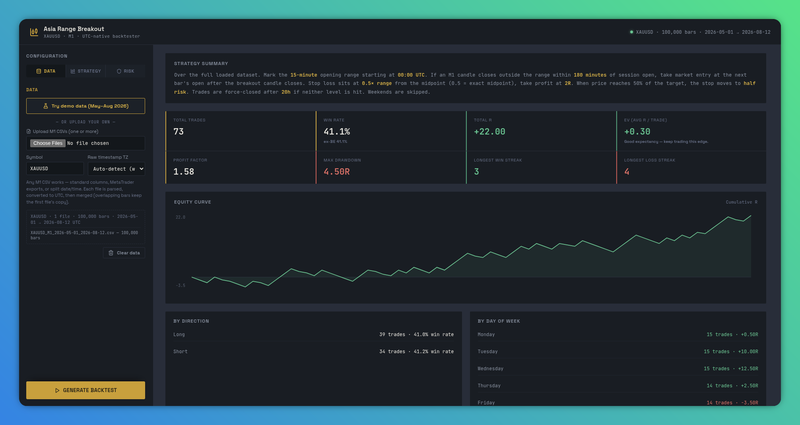

# Asia Range Breakout — Gold (XAUUSD) Backtester

A Python + FastAPI backtesting tool for an Asia-session opening-range breakout
strategy on Gold, M1 timeframe. All logic operates in UTC internally.



## What it does

1. Marks the high/low of the first N minutes after a configurable session
   open time (UTC), default 00:00 UTC / 15 minutes.
2. Watches for the first M1 candle to close outside that range within a
   configurable search window (default 180 minutes).
3. Enters via market order (next bar's open) or limit order (resting at the
   broken boundary, expiring at the search-window deadline).
4. Places the stop loss at the range midpoint by default (adjustable), and
   take profit at a configurable R multiple.
5. Force-closes any trade still open after a configurable max duration.
6. Reports full statistics, an equity curve, breakdowns by direction and
   day-of-week, and a downloadable trade log.

## Try it online (hosted)

No installation needed. Open the hosted app, upload your M1 gold CSV, and run:

**https://orb-backtest-script--anasbassoumi1.replit.app/**

1. Open the link.
2. Click **Try demo data** to load a bundled May–Aug 2026 gold M1 dataset and run a backtest instantly — no files needed. Or upload your own data.
3. Set "Raw timestamp TZ" to your CSV's source timezone (or leave `auto`).
4. Adjust strategy params if you like, then click **Generate backtest**.

## Running it locally

One command (auto-creates a venv, installs deps, reads `PORT` env var, defaults to 8000):

```bash
python3 run.py
```

Then open `http://localhost:8000` in a browser.

Already have the venv set up? Alternative:

```bash
python3 -m venv .venv && source .venv/bin/activate
pip install -r requirements.txt
python3 -m uvicorn app.main:app --host 0.0.0.0 --port 8000
```

## Data

- Upload one or more M1 CSV files with columns `timestamp, open, high, low, close`
  (case-insensitive; common aliases like `date`/`time`/`o`/`h`/`l`/`c` are
  also recognized). If a file's raw timestamps are not already UTC, set
  the "Raw timestamp TZ" field to the correct source timezone (e.g. `EET`,
  `America/New_York`) before uploading — the loader will not guess this.
- Multiple files may be mixed formats (standard columns, MetaTrader-style
  headerless exports, split date/time columns). Each file is parsed
  individually, normalized to UTC, then merged into one dataset; bars with
  duplicate timestamps keep the first file's copy. One report is generated
  over the whole merged dataset.

Free M1 gold data sources to try: HistData.com, Dukascopy, MetaTrader 5's
History Center, or a Kaggle-hosted historical gold dataset. Verify each
source's raw timestamp timezone before uploading.

## API

- `POST /api/data/upload` — upload one or more M1 CSVs (`files` multipart field, repeated for multiple files)
- `GET /api/data/status/{dataset_id}` — check a loaded dataset
- `POST /api/backtest/run` — run a backtest with a given parameter set
- `GET /api/backtest/export/{job_id}` — download the trade log as CSV

## Verified behavior (tested during build)

- SL at `sl_pct_of_range = 0.5` lands exactly on the range midpoint;
  `1.0` lands exactly on the boundary opposite the breakout side.
- `tp_rr = 1.0` produces exactly ±1.0 R outcomes on TP/SL hits (before
  execution costs).
- `sl_ladder` (default `[[1.0, -0.5]]`) moves the
  stop step by step as price advances. Each step is `[trigger_R, sl_R]`: when
  price reaches `trigger_R` (R = risk distance from entry), the stop moves to
  `sl_R` (negative = below entry, 0 = breakeven, positive = locked profit).
  R is always the ORIGINAL risk distance, fixed for the whole trade — a moved
  stop never becomes the reference for later steps. Steps fire in ascending
  trigger order (order of entry doesn't matter). The moved stop applies
  from the next candle; a bar touching both a trigger
  and the old stop counts as the old stop (conservative), and a bar racing
  across several triggers applies the highest reached step. Empty = no moves.
- Limit-mode entries fill exactly at the broken range boundary.
- Trades left open are force-closed at `session_max_hours` (default 20h)
  with `exit_reason = "timeout"`.
- Malformed OHLC rows (e.g. high below open/close) are rejected on upload
  with a clear error rather than silently accepted.
